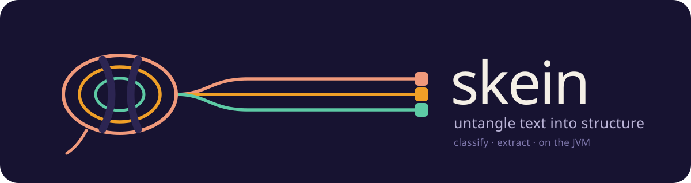
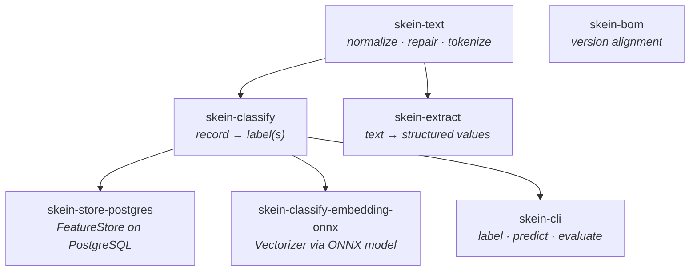

# Skein



> A self-learning, privacy-preserving toolkit for recognizing, classifying and extracting structure
> from messy text and records on the JVM.

The name — a coiled strand of yarn — reflects the purpose: *untangling a skein* of unstructured text
into recognizable patterns. Each module is one thread that builds on the others.

The core is classical statistical machine learning: no GPU, no neural network, no external service,
and features that are irreversible keyed hashes so personal data never enters a model in clear text.
When literal wording is not enough, one optional adapter adds semantic features from an embedding
model — opt-in, in its own module, and inherited by nobody who does not ask for it.

## What it does

1. **Text foundation** — normalization, broken-word repair (`"apart ment"` → `"apartment"`), and a
   typed tokenizer producing pattern signatures (`<word> <date> <numeric>`).
2. **Classification** — assign labels to a whole record. One label, or several when labels co-occur.
   Typo-tolerant, self-training, with calibrated confidences, an abstain option, and an exact
   per-feature explanation of every score.
3. **Extraction** — pull structured values *out of* text via typed-token patterns, slot filling and
   a trainable CRF tagger.

## Quick start

```kotlin
dependencies {
    implementation(platform("io.github.ragin-lundf:skein-bom:<version>"))
    implementation("io.github.ragin-lundf:skein-classify")
}
```

```kotlin
val vectorizer = HashingVectorizer(config = HashingConfig(key0 = secret0, key1 = secret1))

val model = LbfgsMultiLabelLearner(featureCount = vectorizer.dimension()).fit(
    observations = corpus.map { row ->
        MultiLabeledFeatures(
            features = vectorizer.vectorize(text = row.text),
            labels = row.tags.map { tag -> Label(value = tag) }.toSet(),
        )
    },
)

model.predict(features = vectorizer.vectorize(text = "login fails after update"), threshold = 0.5)
    .labels()   // [BUG, AUTHENTICATION]
```

**[Getting started →](docs/getting-started.md)** walks the whole path, including where labels come
from and how to tell whether the model is any good.

Or run something immediately:

```bash
./gradlew :examples:run --args="recipes"
```

## Modules



<details>
<summary>Diagram source</summary>



</details>

| Module | Published | Responsibility |
|---|---|---|
| [`skein-bom`](skein-bom) | yes | Version alignment for consumers |
| [`skein-text`](skein-text) | yes | Normalization, broken-word repair, typed tokenizer, pattern signatures |
| [`skein-classify`](skein-classify) | yes | Record → label(s): schema, feature hashing, learning, evaluation, persistence |
| [`skein-extract`](skein-extract) | yes | Text → structured values: pattern DSL, slot filling, CRF tagging |
| [`skein-classify-embedding-onnx`](skein-classify-embedding-onnx) | yes | Optional `Vectorizer` backed by an ONNX embedding model |
| [`skein-store-postgres`](skein-store-postgres) | yes | Optional PostgreSQL `FeatureStore`, AES-256-GCM at rest |
| [`skein-cli`](skein-cli) | yes | Label, predict, evaluate from the command line |
| [`examples`](examples) | no | Runnable samples |

Heavy dependencies live only in their own adapter. Using feature hashing and an in-memory store
pulls in neither a PostgreSQL driver nor an ONNX Runtime binary.

## Documentation

**[Documentation index →](docs/README.md)**

| | |
|---|---|
| [Getting started](docs/getting-started.md) | Install, train, score. About ten minutes |
| [Architecture](docs/architecture.md) | Modules, layers, data flow, extension points |
| [Bring your own data](docs/bring-your-own-data.md) | Six steps from your records to a model you can defend |
| [Classification](docs/classify/README.md) | Schema, featurisation, single- and multi-label, evaluation, scale |
| [Embeddings](docs/embeddings/README.md) | When they are worth it, and the two integration routes |

## A note on the privacy claim

Feature hashing keeps personal data out of *classification* models: features are irreversible keyed
hashes, and fields marked `PII` never enter the feature text at all.

Two things are different and worth knowing:

- The **CRF tagger** in [`skein-extract`](skein-extract) learns features keyed by token text, so a
  saved CRF model contains fragments of the training text unless written with
  `FeatureRetentionEnum.STRUCTURAL_ONLY`.
- An **embedding vectorizer** produces a lossy but real representation of the text, and an external
  embedding *service* means the text leaves your process. See
  [Embeddings](docs/embeddings/README.md).

## Publishing

Published modules ship a main jar, a sources jar and a Dokka javadoc jar with full POM metadata (MIT,
SCM), to Maven Central (Sonatype Central Portal, GPG-signed via JReleaser) and GitHub Packages.

## Toolchain

- Kotlin 2.3 (K2), JDK 25, Gradle 9.6 (wrapper committed).
- Versions live in [`gradle/libs.versions.toml`](gradle/libs.versions.toml).
- Diagrams are Mermaid; sources and the render script are in
  [`docs/assets/diagrams`](docs/assets/diagrams).

## Changelog

See [CHANGELOG.md](CHANGELOG.md).

## License

[MIT](LICENSE).
