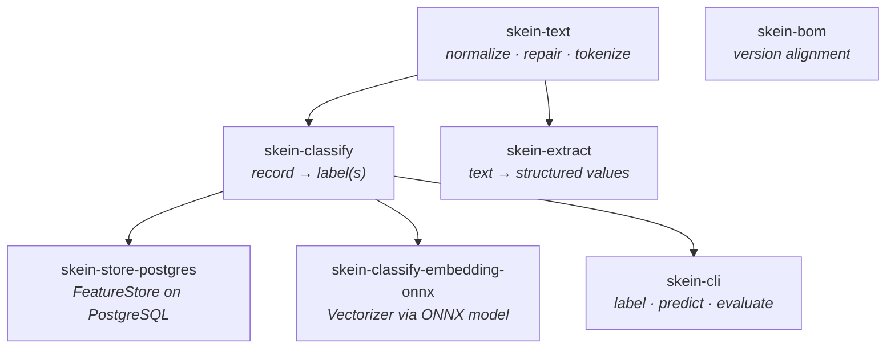
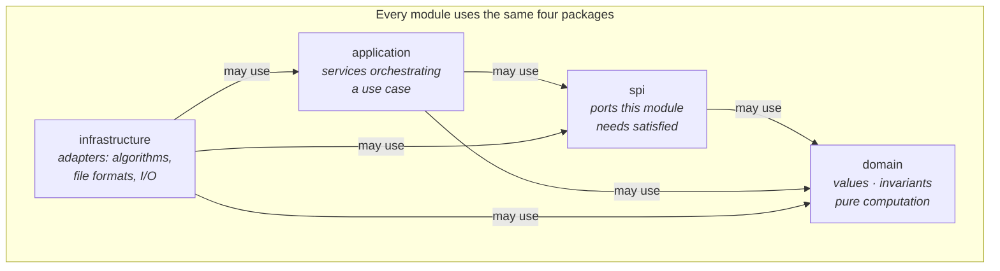
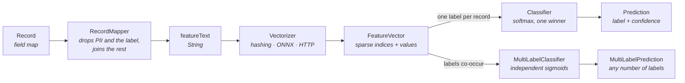

# Architecture

## Modules

Diagram source

`skein-text` depends on nothing. Everything else builds on it, and the two adapters
(`skein-store-postgres`, `skein-classify-embedding-onnx`) depend on `skein-classify` because that
is where the ports they implement live — never the other way round.

That direction is what keeps heavy dependencies optional. PostgreSQL drivers and ONNX Runtime
native binaries exist only inside their own adapter, so a consumer using feature hashing and an
in-memory store inherits neither.

| Module | Published | Depends on | Reach for it when |
|---|---|---|---|
| [`skein-text`](../skein-text) | yes | — | You need normalization, broken-word repair, or typed tokens on their own |
| [`skein-classify`](../skein-classify) | yes | `skein-text` | You want to assign labels to whole records |
| [`skein-extract`](../skein-extract) | yes | `skein-text` | You want structured values *out of* text |
| [`skein-classify-embedding-onnx`](../skein-classify-embedding-onnx) | yes | `skein-classify` | Literal wording is not enough and you need semantic features |
| [`skein-store-postgres`](../skein-store-postgres) | yes | `skein-classify` | Training data must outlive the process |
| [`skein-cli`](../skein-cli) | yes | `skein-classify` | You want to label, predict or evaluate without writing code |
| [`skein-bom`](../skein-bom) | yes | — | Always: it aligns the versions |
| [`examples`](../examples) | no | all | You want something runnable to read |

## Layers

Every module uses the same four packages, and dependencies point inward only.

Diagram source

| Package | Holds | May depend on |
|---|---|---|
| `domain` | Values, entities, invariants, pure computation | Nothing outside its own `domain` |
| `spi` | Ports the module needs someone else to satisfy | `domain` |
| `application` | Services orchestrating domain and ports into a use case | `domain`, `spi` |
| `infrastructure` | Adapters: persistence, file formats, algorithms, external systems | `domain`, `spi`, `application` |

An architecture test scans every module's production sources and fails the build on a wrong import
direction, so this is enforced rather than aspirational.

The practical consequence for you: **pure computation is in `domain` and is trivially testable**.
Pooling an embedding, computing micro-F1, encoding a weight matrix — none of these need a model, a
database or a network to exercise.

## How a record becomes a label

Diagram source

Two decisions shape everything downstream:

1. **Which vectorizer.** Hashed n-grams match literal text and cost 41 µs per record. An embedding
   model recognises meaning and costs 0.1–3 ms. Both produce a `FeatureVector`, and nothing after
   that point can tell the difference. See [Featurisation](classify/featurisation.md) and
   [Embeddings](embeddings/README.md).
2. **Single- or multi-label.** One question decides it: *can two labels be true of the same record
   at once?* See [Single-label](classify/single-label.md) and [Multi-label](classify/multi-label.md).

## Extension points

Implement a port, pass it in. Each lives in the module that needs it.

| Port | Module | Implement it to |
|---|---|---|
| `Vectorizer` | `skein-classify` | Feed features from your own source — an embedding model, a hand-built representation |
| `Classifier` | `skein-classify` | Add a single-label learning algorithm |
| `MultiLabelClassifier` / `BatchLearner` | `skein-classify` | Add a multi-label model or a different optimiser |
| `FeatureStore` | `skein-classify` | Keep training data somewhere other than memory or PostgreSQL |
| `RecordSource` | `skein-classify` | Stream records from your own system |
| `TextNormalizer` | `skein-text` | Change how text is folded before tokenization |
| `EmbeddingRuntime` / `EmbeddingTokenizer` | `skein-classify-embedding-onnx` | Swap the inference engine or the tokenizer |
