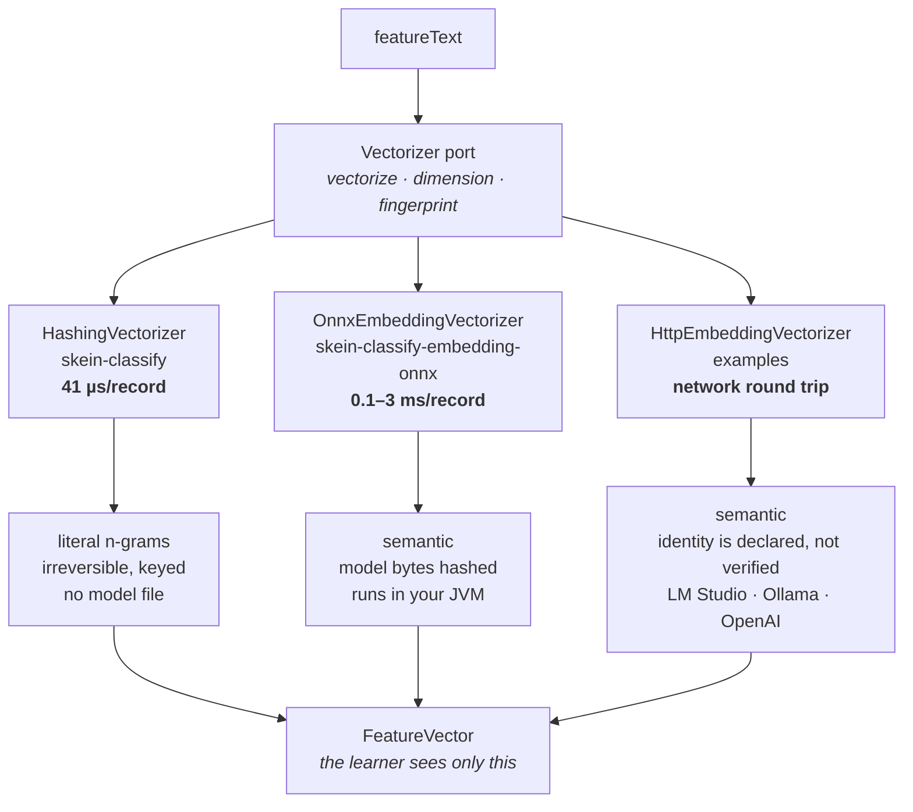
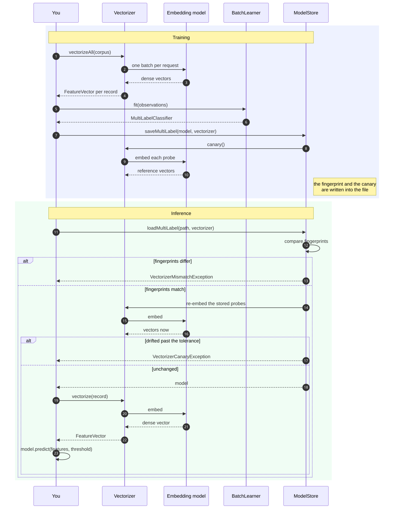
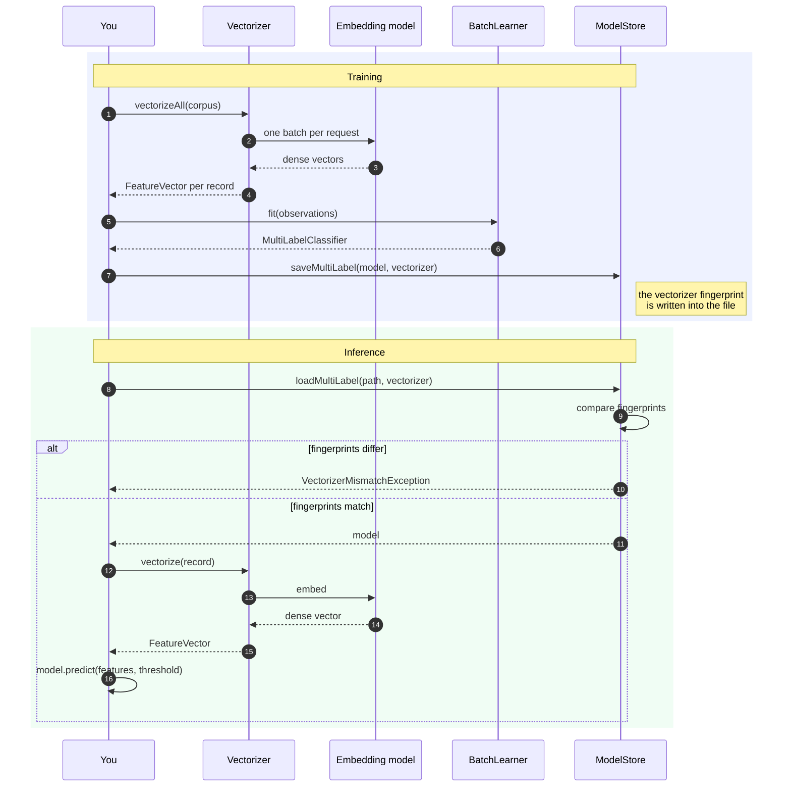

# Embeddings

Hashed n-grams match text as written. A model trained on `eggplant` has learned nothing about
`aubergine`, and no amount of tuning changes that — the two strings share no n-gram that means
anything. When that gap is what limits your accuracy, an embedding model is the fix: it places
related wording near each other in vector space, so the classifier generalises past the exact
strings it was trained on.

This page covers when that trade is worth making and which of the two integration routes to take.
Neither route changes anything downstream: both produce a `FeatureVector`, and the learner, the
objective and the scoring loop cannot tell the difference.

## Is it worth it for you?

Embeddings are slower, add an artifact to manage, and help only with a specific problem. Work
through this before adopting one.

**Reach for an embedding when:**

- Your records use varied wording for the same thing — synonyms, dialects, several languages,
  free-text written by different people.
- Your labels come from a rule engine and you need the model to generalise *past* the rules rather
  than reproduce them.
- You have few examples per label, and literal overlap is too sparse to learn from.

**Stay with hashing when:**

- Your text is templated or machine-generated. The wording is already consistent, so there is
  nothing for semantics to add.
- Throughput matters and your budget is measured in thousands of records per second.
- You cannot ship a model artifact or reach an external service.
- Privacy rules mean feature material must stay irreversible and local. Hashed features are keyed
  and irreversible by construction; an embedding is a lossy but real representation of the text,
  and an external service means the text leaves your process entirely.

**Measure it rather than assuming.** The `examples` module ships the comparison:

```bash
./gradlew :examples:run --args="embedding-service"   # or embedding-onnx
```

It trains the recipe tagger both ways and scores both against a hand-written held-out set that uses
wording the training data never contains — `aubergine`, `courgette`, `cacio e pepe`. That is exactly
where an embedding either earns its cost or does not, and the example prints the difference for
*your* model rather than quoting someone else's benchmark.

## What it costs

| Vectorizer | Per record, one core | Throughput | Model artifact |
|---|---|---|---|
| `HashingVectorizer` | **41 µs** | **~24,000/s** | none |
| Static embeddings (Model2Vec class) | ~100–200 µs | 5,000–10,000/s | 8–100 MB |
| MiniLM-class transformer, ONNX int8 | ~1–3 ms | 300–1,000/s per core | 20–120 MB |
| Larger transformer (768–1024 dims) | ~3–10 ms | 100–300/s per core | 300 MB–2 GB |

A transformer encoder can put a 1,000 records/s target at risk on featurisation alone, before any
classification happens. At 2 ms per record, embedding a million rows is **33 minutes per training
run** — which is why batching and caching are built into both routes, and why deduplicating first
(see [Scale](../classify/scale.md)) matters more here than anywhere else.

The classifier itself gets *smaller*. A 384-dimension embedding across 237 labels is
`384 × 237 × 4 bytes = 364 KB`, against 17 MB for a sparse n-gram model of the same taxonomy.
Pruning stops being worth doing. The artifact that matters becomes the embedding model.

## The two routes



<details>
<summary>Diagram source</summary>



</details>

| | **Route A — your own model, in-process** | **Route B — an external service** |
|---|---|---|
| Module | [`skein-classify-embedding-onnx`](../../skein-classify-embedding-onnx) (published) | `HttpEmbeddingVectorizer` in [`examples`](../../examples) (copy it) |
| Guide | [onnx-local.md](onnx-local.md) | [external-service.md](external-service.md) |
| Setup | Export the model once, ship the file | Start a server, point at a URL |
| Runs | In your JVM, no network | Wherever the service runs |
| **Model identity** | **The file's bytes are hashed** — a swapped model is refused | Declared by you, **not verifiable** |
| Text leaves your process | No | Yes |
| Latency | Inference only | Inference plus a round trip |
| Changing models | Re-export, redeploy | Configuration change |
| Dependencies | ONNX Runtime + tokenizer native binaries | JDK HTTP client |

**Take route A for anything you run in production.** The difference that matters is the fourth row.

## Why model identity is the whole game

A model trained on embeddings from model X and scored with embeddings from model Y does not fail.
The vectors have the right width, the weights multiply, the labels come back with confident
probabilities — and they are wrong. There is no exception, nothing unusual in the output, and no
way to notice from the outside.

Skein defends against this with a fingerprint written into the model file and verified on load:



<details>
<summary>Diagram source</summary>



</details>

How much that fingerprint is worth depends on the route:

- **Route A hashes the model file's contents.** A model replaced in place under an unchanged name
  changes the digest, and the load is refused. This is a real guarantee.
- **Route B hashes what you declared** — the model name, a revision string you maintain, the input
  prefix, the width. Nothing in the embeddings protocol reveals which weights answered, so if the
  service is updated and you do not bump `modelRevision`, the check passes and the model is quietly
  wrong.

That asymmetry is the reason route A is the production recommendation and route B is the way to
find out whether embeddings help you at all.

## Two ways to underperform silently

Neither of these throws. Both cost accuracy you will struggle to explain.

**The wrong input prefix.** E5-family models are trained with `query: ` and `passage: ` markers and
lose accuracy without them. For classification every record is a passage, so use `passage: `
consistently — on the training corpus *and* at inference. Other families want no prefix at all.
Check the model card.

**The wrong pooling.** A sentence encoder emits one vector per token; collapsing them into one
sentence vector has to match how the model was trained. Mean pooling over the non-padding tokens is
what sentence-transformers models expect and is the default here. `CLS` is correct only for models
trained to put a sentence representation at the first position.

Both are part of the fingerprint, so changing either invalidates existing models by design.

## Next

- [Choosing a model](choosing-a-model.md) — concrete small multilingual options and how to judge them
- [Route A: local ONNX](onnx-local.md) — export, integrate, deploy
- [Route B: external service](external-service.md) — LM Studio and OpenAI-compatible servers
